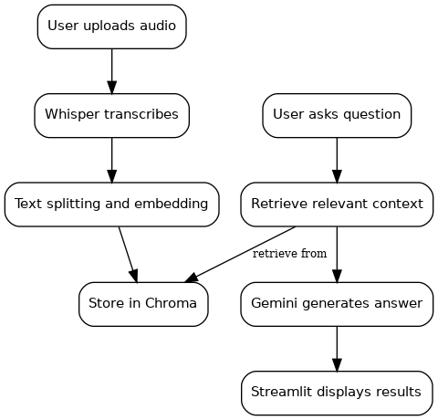
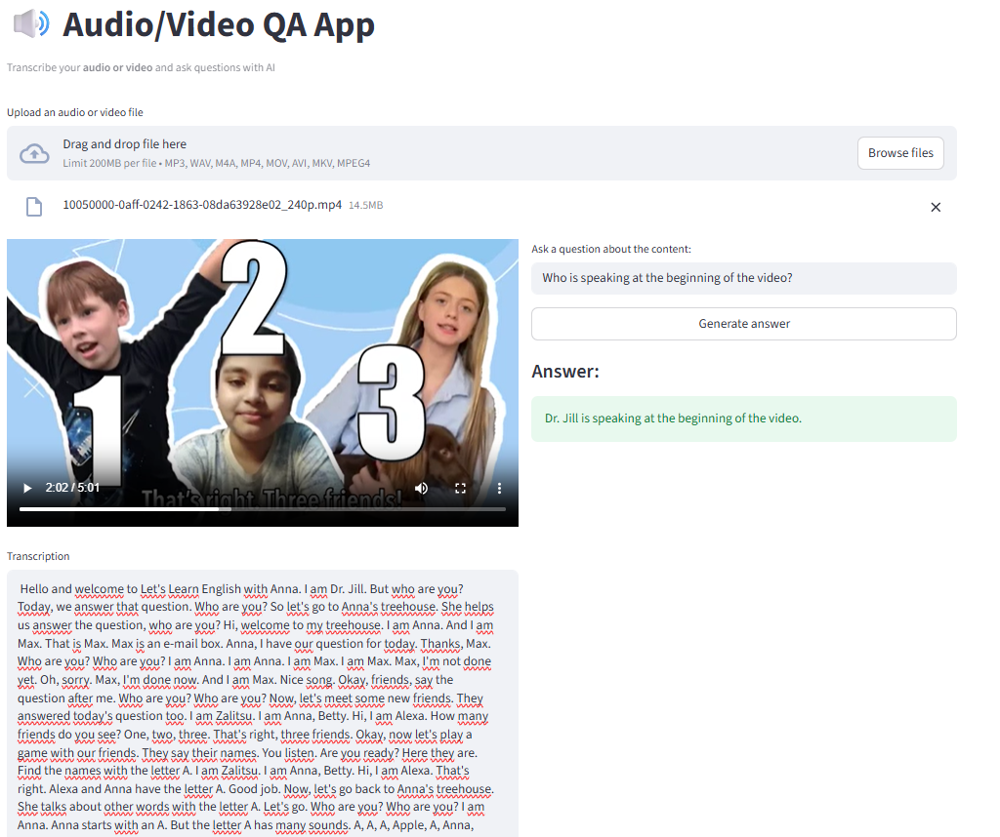

## Audio Question-Answering App

This project demonstrates how to build an **Audio Question-Answering App** using **Streamlit**, **Whisper**, and **LangChain**.  
The app allows you to upload an audio or video file, automatically **transcribe** its content, and then **ask questions** about the transcription using **Google’s Gemini model**.

### a. Key Features
- **Audio/Video transcription** using OpenAI Whisper  
- **Semantic search & retrieval** with Chroma and Hugging Face embeddings  
- **Context-aware answers** generated by Google Gemini  
- **Interactive web interface** built with Streamlit  

### b. Project Workflow

Here’s a visual representation of the workflow:

  
*Figure: App workflow from media upload to Q&A.*

Steps in detail:
1. **Upload media**: Users upload an audio or video file.  
2. **Transcription**: The app transcribes the media content using Whisper.  
3. **Indexing**: Transcribed text is split into chunks and stored in a vector database (Chroma) using embeddings.  
4. **Question & Answer**: Users can ask questions about the content, and answers are generated by Google Gemini based on the indexed transcription.  

### c. Demo

See the app in action:

  
*Figure: Demo of the app interface with transcription and Q&A functionality.*

By the end of this project, you will have a fully functional system that combines **speech recognition**, **vector search**, and **LLM-based reasoning** to efficiently understand and query audio content.

### d. Setup & Installation
1. Clone the repository:
   ```bash
   git clone https://github.com/DARIF-YS/audio-qa-app.git
   cd audio-qa-app

2. Install dependencies:
    ```bash
    pip install -r requirements.txt

3. Create a .env file in the project root and add your Google API key:
    
    GOOGLE_API_KEY=YOUR_GOOGLE_API_KEY

4. Run the app:
    ```bash
    streamlit run app.py
__

*Developed by Yassine DARIF - 2025*
